# GCP: Real-Time MySQL CDC to BigQuery using Debezium Server and Pub/Sub

This project provisions a real-time Change Data Capture (CDC) pipeline on Google Cloud Platform using Terraform.

It automates the deployment of a private Cloud SQL for MySQL instance, a GCE VM to run Debezium Server, a Cloud Pub/Sub topic, and a BigQuery table with a direct Pub/Sub subscription.

Debezium Server captures data changes from MySQL and streams them to Pub/Sub. The BigQuery subscription then ingests these events directly into a BigQuery table, providing a scalable, serverless pipeline for real-time analytics.

## Architecture Diagram

The current architecture consists of the following flow:

**Cloud SQL (MySQL) -> GCE VM (Debezium Server) -> Cloud Pub/Sub -> BigQuery**

```mermaid
graph TD
    subgraph "Google Cloud Platform"
        direction LR
        subgraph "Custom VPC (Private Network)"
            direction LR
            cloud_sql["Cloud SQL for MySQL<br><i>(Private IP)</i>"]
            psc["Private Service Connect<br>Endpoint"]
            gce_vm["GCE VM<br><i>(Debezium Server)</i>"]
        end

        subgraph "Serverless"
            direction LR
            pubsub["Cloud Pub/Sub Topic"]
            bigquery_sub["BigQuery Subscription"]
            bigquery["BigQuery Table"]
        end

        cloud_sql -- "CDC Binlog Stream" --> psc
        psc -- "Securely Connects" --> gce_vm
        gce_vm -- "Publishes CDC Events" --> pubsub
        pubsub -- "Pushes Messages" --> bigquery_sub
        bigquery_sub -- "Writes Data Directly" --> bigquery
    end
```



## Architecture Components

1.  **VPC & Subnets**: A custom VPC is created with a private subnet to host the cloud resources securely.
2.  **Cloud SQL for MySQL**: A private instance acts as the transactional database source. It has **no public IP** and is not directly exposed to the internet.
3.  **Private Service Connect (PSC)**: A PSC endpoint is created to provide a stable, private IP address for the Cloud SQL instance, allowing services within the VPC to connect to it securely.
4.  **GCE Client VM (`mysql-client-vm`)**: A Debian VM is provisioned in the private subnet. Its startup script automatically installs Docker Engine and pulls the Debezium Server image.
5.  **Debezium Server**: Runs as a Docker container on the GCE VM. It connects to the Cloud SQL instance via its PSC endpoint and streams all data changes to a Google Cloud Pub/Sub topic.
6.  **Google Cloud Storage (GCS)**: A temporary GCS bucket is used during the provisioning process to copy local `debezium-server` configuration files to the GCE VM. This bucket is automatically created and deleted by Terraform.
7.  **Cloud Pub/Sub**: A Pub/Sub topic is created to receive the CDC events from Debezium Server. This decouples the data producer (Debezium) from the consumer (BigQuery).
8.  **BigQuery and BigQuery Subscription**: A BigQuery dataset and table are provisioned to store the incoming CDC data. A **BigQuery subscription** is attached directly to the Pub/Sub topic, allowing messages to be written to the table automatically without any intermediate services like Dataflow.

## Prerequisites

1.  **Terraform**: Version v1.0 or later installed.
2.  **Google Cloud SDK**: `gcloud` CLI installed and authenticated.
3.  **GCP Project**: A Google Cloud project with billing enabled.
4.  **APIs**: The Service Usage API (`serviceusage.googleapis.com`) should be enabled. The Terraform code will enable the rest of the required APIs.
5.  **Terraform State Bucket**: You must create a GCS bucket beforehand to store the Terraform state files.
    ```sh
    gsutil mb -p <YOUR_GCP_PROJECT_ID> gs://tfstate-<YOUR_GCP_PROJECT_ID>
    gsutil versioning set on gs://tfstate-<YOUR_GCP_PROJECT_ID>
    ```
6.  **Set IAM Permissions for Terraform**:
    The Compute Engine default service account, which Terraform may use for authentication, needs `Storage Admin` permissions to manage the state bucket.
    ```bash
    PROJECT_ID=$(gcloud config get-value project)
    PROJECT_NUMBER=$(gcloud projects describe $PROJECT_ID --format="value(projectNumber)")
    gcloud projects add-iam-policy-binding $(gcloud config get-value project) \
        --member="serviceAccount:${PROJECT_NUMBER}-compute@developer.gserviceaccount.com"
        --role="roles/storage.admin"
    ```

## Directory Structure

-   `terraform/environments/dev/`: The entrypoint for running Terraform commands.
-   `terraform/modules/`: Contains reusable infrastructure modules.
    -   `network/`: Provisions the VPC and subnets.
    -   `debezium-source/`: Provisions the Cloud SQL for MySQL instance and its PSC endpoint.
    -   `gce-client/`: Provisions the GCE VM to run Debezium Server and the destination Pub/Sub topic.
    -   `bigquery-sink/`: Provisions the BigQuery dataset, table, and the BigQuery subscription that connects Pub/Sub to BigQuery.
-   `debezium-server/config/`: Contains the Debezium Server configuration files.

## Configuration

1.  **Update Backend Configuration**:
    In `terraform/environments/dev/main.tf`, update the `backend "gcs"` block with the name of your Terraform state bucket.

    ```terraform
    terraform {
      backend "gcs" {
        bucket = "tfstate-<YOUR_GCP_PROJECT_ID>" # <-- UPDATE THIS
        prefix = "gcp-debezium-mysql-to-pubsub-bigquery/terraform"
      }
    }
    ```

2.  **Create a Variables File**:
    In the `terraform/environments/dev` directory, copy the example variables file.
    ```sh
    cp terraform.tfvars.example terraform.tfvars
    ```

3.  **Update `terraform.tfvars`**:
    Edit `terraform.tfvars` and replace the placeholder values, especially `project_id`.

4.  **Update Debezium Configuration**:
    Edit `debezium-server/config/application.properties.example` and save it as `application.properties`. This file configures Debezium to connect to the MySQL source and send records to the Pub/Sub sink. Update the following properties. The Terraform outputs will provide the required values after deployment.
    *   `debezium.sink.pubsub.project.id`: Set this to your GCP `project_id` from `terraform.tfvars`.
    *   `debezium.source.database.hostname`: Set this to the `cloud_sql_psc_endpoint_ip` output from Terraform.
    *   `debezium.source.database.user`: Set this to the `datastream_user_name` output from Terraform.
    *   `debezium.source.database.password`: Set this to the `datastream_user_password` output from Terraform.
    *   `debezium.source.database.dbname`: Set this to `testdb`. This is the default database created by the Terraform module.
    *   `debezium.source.topic.prefix`: This property acts as a logical name for your source system (e.g., `debezium-topic`). Debezium combines this prefix with the database and table name to determine the destination topic name.
    *   **IMPORTANT**: The `pubsub_topic_name` variable in your `terraform.tfvars` file must **exactly match** the topic name that Debezium will generate. The format is `{topic.prefix}.{database.dbname}.{table_name}`. For example, if your `topic.prefix` is `debezium-topic`, your database is `testdb`, and you are capturing the `retail_trans` table, you must set `pubsub_topic_name = "debezium-topic.testdb.retail_trans"` in `terraform.tfvars`.

## Deployment

1.  **Navigate to the environment directory**:
    ```sh
    cd terraform/environments/dev
    ```

2.  **Initialize Terraform**:
    ```sh
    terraform init
    ```

3.  **Plan and Apply**:
    Review the plan and apply the configuration.
    ```bash
    terraform plan
    terraform apply
    ```

## End-to-End Pipeline Verification

After deploying the infrastructure, follow these steps to configure the database, populate it with initial data, start the Debezium server, and verify that the pipeline is capturing changes correctly.

### Step 1: Grant SQL Permissions

First, you must connect to the Cloud SQL instance to grant the necessary permissions for CDC. The easiest way to perform this one-time setup is by using **Cloud SQL Studio** from the GCP Console.

#### a. Get Admin Password

Retrieve the generated admin password from the Terraform output. From the `terraform/environments/dev` directory, run:
```bash
terraform output admin_user_password
```

#### b. Connect via Cloud SQL Studio

1.  Open the [Cloud SQL instances page](https://console.cloud.google.com/sql/instances) in the GCP Console.
2.  Find your instance (e.g., `mysql-src-ds`) and click its name.
3.  From the left menu, select **"Cloud SQL Studio"**.
4.  Log in with the username `rdsadmin` and the password from the previous step. The database name is `testdb`.

#### c. Execute the GRANT Command

In the Cloud SQL Studio query editor, run the following SQL commands to grant the `datastream` user the required replication privileges:
```sql
GRANT REPLICATION SLAVE, SELECT, REPLICATION CLIENT ON *.* TO 'datastream'@'%';
FLUSH PRIVILEGES;
```

### Step 2: Generate and Insert Initial Data

Before starting Debezium, let\'s create a table and populate it with sample data. Debezium will perform an initial snapshot of this data when it first connects.

#### a. Navigate to the scripts directory

From your local machine (not the VM), go to the scripts directory:
```bash
# If you are in terraform/environments/dev
cd ../../../scripts 
```

#### b. Setup the Python environment

Follow the instructions in `scripts/README.md` to set up the `uv` virtual environment and install dependencies.

#### c. Generate SQL statements

This command will create a file named `sample_data.sql` containing the `CREATE TABLE` statement and 1000 `INSERT` statements.
```bash
uv run python generate_fake_sql.py --generate-ddl --max-count 1000 > sample_data.sql
```

#### d. Import the SQL data via Cloud SQL Studio

The simplest way to import the data is to use Cloud SQL Studio again.
1.  Connect to your database in Cloud SQL Studio as described in **Step 1**.
2.  Open the `sample_data.sql` file in a text editor and copy its contents.
3.  Paste the SQL into the query editor and click **"Run"**.

### Step 3: Start the Debezium Server

Now that the source database is ready, connect to the GCE VM to configure and start the Debezium Server.

#### a. Connect to the GCE VM

Use the `gcloud` CLI to SSH into the VM via IAP.
```bash
gcloud compute ssh mysql-client-vm --zone=$(terraform output -raw gce_client_zone) --project=$(gcloud config get-value project)
```

#### b. Configure Docker Permissions
To avoid typing `sudo` for every `docker` command, you can add your user to the `docker` group.

1.  **Add the current user to the `docker` group:**
    ```bash
sudo usermod -aG docker $USER
    ```

2.  **Apply the new group membership.** You can either log out and log back in, or run the following command to activate the changes for your current session:
    ```bash
    newgrp docker
    ```

#### c. Configure and Run Debezium

On the VM, prepare the configuration and start the Debezium Server Docker container.
```bash
# The config files were copied to /opt/debezium-server by the startup script
mkdir -p $HOME/config
sudo cp /opt/debezium-server/config/application.properties.example $HOME/config/application.properties
sudo chown -R $USER:root $HOME/config/

# Debezium is configured to store offsets and schema history on the local filesystem.
# Create the data directory and files that will be mounted into the Docker container.
# This ensures the files exist with the correct ownership for Debezium to write to.
mkdir -p $HOME/data
touch $HOME/data/offset.dat
touch $HOME/data/schema_history.dat
sudo chown -R $USER:root $HOME/data/

# IMPORTANT: Update application.properties with the correct values from terraform output
# You will need the 'cloud_sql_psc_endpoint_ip', 'datastream_user_name', and 'datastream_user_password'
vi $HOME/config/application.properties

mkdir -p $HOME/data
touch $HOME/data/offset.dat
touch $HOME/data/schema_history.dat
sudo chown -R $USER:root $HOME/data/

# Run the Debezium server using the script provided
/opt/debezium-server/run_debezium_server.sh
```

You should see logs indicating that the container is starting and performing an initial snapshot.
<details>
<summary>Click to expand Debezium Server Logs</summary>
<pre>
    No existing container named 'debezium' found.
    Starting a new container named 'debezium'...
        __       __                 _
    ____/ /___   / /_   ___  ____   (_)__  __ ____ ___
    / __  // _ \ / __ \ / _ \/_  /  / // / / // __ `__ \
    / /_/ //  __// /_/ //  __/ / /_ / // /_/ // / / / / /
    \__,_/ \___//_.___/ \___/ /___//_/ \__,_//_/ /_/ /_/


                                Powered by Quarkus 3.8.5
    2025-09-02 08:46:35,402 INFO  [io.api.reg.res.JacksonDateTimeCustomizer] (main) ---------------------------------------------------------------------
    2025-09-02 08:46:35,402 INFO  [io.api.reg.res.JacksonDateTimeCustomizer] (main) Legacy REST API date formats enabled (this is currently the default).
    2025-09-02 08:46:35,402 INFO  [io.api.reg.res.JacksonDateTimeCustomizer] (main)
    2025-09-02 08:46:35,402 INFO  [io.api.reg.res.JacksonDateTimeCustomizer] (main) For maximum compatibility and to ease upgrades from older versions
    2025-09-02 08:46:35,402 INFO  [io.api.reg.res.JacksonDateTimeCustomizer] (main) of Registry, the date format used in the REST API is not compliant
    2025-09-02 08:46:35,402 INFO  [io.api.reg.res.JacksonDateTimeCustomizer] (main) with OpenAPI standards (due to a bug in older versions).  Please
    2025-09-02 08:46:35,402 INFO  [io.api.reg.res.JacksonDateTimeCustomizer] (main) make sure you upgrade all of your client applications to use the
    2025-09-02 08:46:35,402 INFO  [io.api.reg.res.JacksonDateTimeCustomizer] (main) latest client version.  The next release will fix the date format
    2025-09-02 08:46:35,402 INFO  [io.api.reg.res.JacksonDateTimeCustomizer] (main) bug, which will result in older clients no longer being compatible
    2025-09-02 08:46:35,402 INFO  [io.api.reg.res.JacksonDateTimeCustomizer] (main) with the REST API.
    2025-09-02 08:46:35,402 INFO  [io.api.reg.res.JacksonDateTimeCustomizer] (main)
    2025-09-02 08:46:35,402 INFO  [io.api.reg.res.JacksonDateTimeCustomizer] (main) If you would like to fix the date format bug in THIS version of
    2025-09-02 08:46:35,402 INFO  [io.api.reg.res.JacksonDateTimeCustomizer] (main) Registry (great!) please set the following ENV variable + value:
    2025-09-02 08:46:35,402 INFO  [io.api.reg.res.JacksonDateTimeCustomizer] (main)
    2025-09-02 08:46:35,402 INFO  [io.api.reg.res.JacksonDateTimeCustomizer] (main) REGISTRY_APIS_V2_DATE_FORMAT=yyyy-MM-dd'T'HH:mm:ss'Z'
    2025-09-02 08:46:35,402 INFO  [io.api.reg.res.JacksonDateTimeCustomizer] (main)
    2025-09-02 08:46:35,402 INFO  [io.api.reg.res.JacksonDateTimeCustomizer] (main) Doing this will result in a REST API that is OpenAPI compliant, but
    2025-09-02 08:46:35,402 INFO  [io.api.reg.res.JacksonDateTimeCustomizer] (main) please remember to upgrade all your client applications first!
    2025-09-02 08:46:35,402 INFO  [io.api.reg.res.JacksonDateTimeCustomizer] (main) ---------------------------------------------------------------------
    2025-09-02 08:46:37,237 INFO  [io.deb.ser.BaseChangeConsumer] (main) Using 'io.debezium.server.BaseChangeConsumer$Lambda/0x00007fd040399310@5c7dfc05' stream name mapper
    2025-09-02 08:46:37,414 INFO  [io.deb.ser.pub.PubSubChangeConsumer] (main) Using default PublisherBuilder 'io.debezium.server.pubsub.PubSubChangeConsumer$Lambda/0x00007fd0403b4400@6baf25d7'
    2025-09-02 08:46:37,414 INFO  [io.deb.ser.DebeziumServer] (main) Consumer 'io.debezium.server.pubsub.PubSubChangeConsumer' instantiated
    2025-09-02 08:46:37,512 INFO  [io.deb.emb.asy.AsyncEmbeddedEngine] (main) Consumer doesn't support tombstone events, setting 'tombstones.on.delete' to false.
    2025-09-02 08:46:37,584 INFO  [org.apa.kaf.con.jso.JsonConverterConfig] (main) JsonConverterConfig values:
        converter.type = header
        decimal.format = BASE64
        replace.null.with.default = true
        schemas.cache.size = 1000
        schemas.enable = true

    2025-09-02 08:46:37,595 INFO  [org.apa.kaf.con.jso.JsonConverterConfig] (main) JsonConverterConfig values:
        converter.type = key
        decimal.format = BASE64
        replace.null.with.default = true
        schemas.cache.size = 1000
        schemas.enable = true

    2025-09-02 08:46:37,606 INFO  [org.apa.kaf.con.jso.JsonConverterConfig] (main) JsonConverterConfig values:
        converter.type = value
        decimal.format = BASE64
        replace.null.with.default = true
        schemas.cache.size = 1000
        schemas.enable = true

    2025-09-02 08:46:37,670 INFO  [io.deb.emb.EmbeddedWorkerConfig] (main) EmbeddedWorkerConfig values:
        access.control.allow.methods =
        access.control.allow.origin =
        admin.listeners = null
        auto.include.jmx.reporter = true
        bootstrap.servers = [localhost:9092]
        client.dns.lookup = use_all_dns_ips
        config.providers = []
        connector.client.config.override.policy = All
        header.converter = class org.apache.kafka.connect.storage.SimpleHeaderConverter
        key.converter = class org.apache.kafka.connect.json.JsonConverter
        listeners = [http://:8083]
        metric.reporters = []
        metrics.num.samples = 2
        metrics.recording.level = INFO
        metrics.sample.window.ms = 30000
        offset.flush.interval.ms = 0
        offset.flush.timeout.ms = 5000
        offset.storage.file.filename = data/offset.dat
        offset.storage.partitions = null
        offset.storage.replication.factor = null
        offset.storage.topic =
        plugin.discovery = hybrid_warn
        plugin.path = null
        response.http.headers.config =
        rest.advertised.host.name = null
        rest.advertised.listener = null
        rest.advertised.port = null
        rest.extension.classes = []
        ssl.cipher.suites = null
        ssl.client.auth = none
        ssl.enabled.protocols = [TLSv1.2, TLSv1.3]
        ssl.endpoint.identification.algorithm = https
        ssl.engine.factory.class = null
        ssl.key.password = null
        ssl.keymanager.algorithm = SunX509
        ssl.keystore.certificate.chain = null
        ssl.keystore.key = null
        ssl.keystore.location = null
        ssl.keystore.password = null
        ssl.keystore.type = JKS
        ssl.protocol = TLSv1.3
        ssl.provider = null
        ssl.secure.random.implementation = null
        ssl.trustmanager.algorithm = PKIX
        ssl.truststore.certificates = null
        ssl.truststore.location = null
        ssl.truststore.password = null
        ssl.truststore.type = JKS
        task.shutdown.graceful.timeout.ms = 5000
        topic.creation.enable = true
        topic.tracking.allow.reset = true
        topic.tracking.enable = true
        value.converter = class org.apache.kafka.connect.json.JsonConverter

    2025-09-02 08:46:37,715 INFO  [org.apa.kaf.con.jso.JsonConverterConfig] (main) JsonConverterConfig values:
        converter.type = key
        decimal.format = BASE64
        replace.null.with.default = true
        schemas.cache.size = 1000
        schemas.enable = false

    2025-09-02 08:46:37,722 INFO  [org.apa.kaf.con.jso.JsonConverterConfig] (main) JsonConverterConfig values:
        converter.type = value
        decimal.format = BASE64
        replace.null.with.default = true
        schemas.cache.size = 1000
        schemas.enable = false

    2025-09-02 08:46:37,729 INFO  [io.deb.ser.DebeziumServer] (main) Engine executor started
    2025-09-02 08:46:37,736 INFO  [io.deb.emb.asy.AsyncEmbeddedEngine] (pool-7-thread-1) Engine state has changed from 'CREATING' to 'INITIALIZING'
    2025-09-02 08:46:37,864 INFO  [io.deb.con.CommonConnectorConfig] (pool-7-thread-1) Loading the custom source info struct maker plugin: io.debezium.connector.mysql.MySqlSourceInfoStructMaker
    2025-09-02 08:46:38,078 INFO  [io.quarkus] (main) debezium-server-dist 3.0.0.Final on JVM (powered by Quarkus 3.8.5) started in 4.395s. Listening on: http://0.0.0.0:8080
    2025-09-02 08:46:38,083 INFO  [io.quarkus] (main) Profile prod activated.
    2025-09-02 08:46:38,085 INFO  [io.quarkus] (main) Installed features: [cdi, kubernetes-client, resteasy, resteasy-jackson, smallrye-context-propagation, smallrye-health, vertx]
    2025-09-02 08:46:38,762 INFO  [io.deb.con.mys.jdb.MySqlConnection] (pool-7-thread-1) Using 'SHOW MASTER STATUS' to get binary log status
    2025-09-02 08:46:38,782 INFO  [io.deb.con.bin.BinlogConnector] (pool-7-thread-1) Successfully tested connection for jdbc:mysql://10.1.0.10:3306/?useInformationSchema=true&nullCatalogMeansCurrent=false&useUnicode=true&characterEncoding=UTF-8&characterSetResults=UTF-8&zeroDateTimeBehavior=CONVERT_TO_NULL&connectTimeout=30000 with user 'datastream'
    2025-09-02 08:46:38,790 INFO  [io.deb.jdb.JdbcConnection] (pool-10-thread-1) Connection gracefully closed
    2025-09-02 08:46:38,816 INFO  [org.apa.kaf.con.jso.JsonConverterConfig] (pool-7-thread-1) JsonConverterConfig values:
        converter.type = key
        decimal.format = BASE64
        replace.null.with.default = true
        schemas.cache.size = 1000
        schemas.enable = false

    2025-09-02 08:46:38,818 INFO  [org.apa.kaf.con.sto.FileOffsetBackingStore] (pool-7-thread-1) Starting FileOffsetBackingStore with file data/offset.dat
    2025-09-02 08:46:38,830 INFO  [io.deb.emb.asy.AsyncEmbeddedEngine] (pool-7-thread-1) Engine state has changed from 'INITIALIZING' to 'CREATING_TASKS'
    2025-09-02 08:46:38,853 INFO  [io.deb.emb.asy.AsyncEmbeddedEngine] (pool-7-thread-1) Engine state has changed from 'CREATING_TASKS' to 'STARTING_TASKS'
    2025-09-02 08:46:38,856 INFO  [io.deb.emb.asy.AsyncEmbeddedEngine] (pool-7-thread-1) Waiting max. for 180000 ms for individual source tasks to start.
    2025-09-02 08:46:38,859 INFO  [io.deb.con.com.BaseSourceTask] (pool-8-thread-1) Starting MySqlConnectorTask with configuration:
    2025-09-02 08:46:38,862 INFO  [io.deb.con.com.BaseSourceTask] (pool-8-thread-1)    connector.class = io.debezium.connector.mysql.MySqlConnector
    2025-09-02 08:46:38,863 INFO  [io.deb.con.com.BaseSourceTask] (pool-8-thread-1)    record.processing.shutdown.timeout.ms = 1000
    2025-09-02 08:46:38,863 INFO  [io.deb.con.com.BaseSourceTask] (pool-8-thread-1)    record.processing.order = ORDERED
    2025-09-02 08:46:38,864 INFO  [io.deb.con.com.BaseSourceTask] (pool-8-thread-1)    schema.history.internal.file.filename = data/schema_history.dat
    2025-09-02 08:46:38,864 INFO  [io.deb.con.com.BaseSourceTask] (pool-8-thread-1)    schema.history.internal.pubsub.project.id = staging-468404
    2025-09-02 08:46:38,864 INFO  [io.deb.con.com.BaseSourceTask] (pool-8-thread-1)    tombstones.on.delete = false
    2025-09-02 08:46:38,865 INFO  [io.deb.con.com.BaseSourceTask] (pool-8-thread-1)    topic.prefix = debezium-topic
    2025-09-02 08:46:38,865 INFO  [io.deb.con.com.BaseSourceTask] (pool-8-thread-1)    offset.storage.file.filename = data/offset.dat
    2025-09-02 08:46:38,866 INFO  [io.deb.con.com.BaseSourceTask] (pool-8-thread-1)    offset.storage.pubsub.project.id = staging-468404
    2025-09-02 08:46:38,866 INFO  [io.deb.con.com.BaseSourceTask] (pool-8-thread-1)    record.processing.threads =
    2025-09-02 08:46:38,867 INFO  [io.deb.con.com.BaseSourceTask] (pool-8-thread-1)    errors.retry.delay.initial.ms = 300
    2025-09-02 08:46:38,867 INFO  [io.deb.con.com.BaseSourceTask] (pool-8-thread-1)    value.converter = org.apache.kafka.connect.json.JsonConverter
    2025-09-02 08:46:38,868 INFO  [io.deb.con.com.BaseSourceTask] (pool-8-thread-1)    key.converter = org.apache.kafka.connect.json.JsonConverter
    2025-09-02 08:46:38,868 INFO  [io.deb.con.com.BaseSourceTask] (pool-8-thread-1)    database.user = datastream
    2025-09-02 08:46:38,869 INFO  [io.deb.con.com.BaseSourceTask] (pool-8-thread-1)    database.dbname = testdb
    2025-09-02 08:46:38,869 INFO  [io.deb.con.com.BaseSourceTask] (pool-8-thread-1)    database.server.id = 12345
    2025-09-02 08:46:38,869 INFO  [io.deb.con.com.BaseSourceTask] (pool-8-thread-1)    offset.storage = org.apache.kafka.connect.storage.FileOffsetBackingStore
    2025-09-02 08:46:38,870 INFO  [io.deb.con.com.BaseSourceTask] (pool-8-thread-1)    database.server.name = mysql-src-ds
    2025-09-02 08:46:38,870 INFO  [io.deb.con.com.BaseSourceTask] (pool-8-thread-1)    offset.flush.timeout.ms = 5000
    2025-09-02 08:46:38,871 INFO  [io.deb.con.com.BaseSourceTask] (pool-8-thread-1)    errors.retry.delay.max.ms = 10000
    2025-09-02 08:46:38,871 INFO  [io.deb.con.com.BaseSourceTask] (pool-8-thread-1)    database.port = 3306
    2025-09-02 08:46:38,872 INFO  [io.deb.con.com.BaseSourceTask] (pool-8-thread-1)    offset.flush.interval.ms = 0
    2025-09-02 08:46:38,872 INFO  [io.deb.con.com.BaseSourceTask] (pool-8-thread-1)    offset.storage.pubsub.region = us-central1
    2025-09-02 08:46:38,872 INFO  [io.deb.con.com.BaseSourceTask] (pool-8-thread-1)    internal.task.management.timeout.ms = 180000
    2025-09-02 08:46:38,873 INFO  [io.deb.con.com.BaseSourceTask] (pool-8-thread-1)    schema.history.internal = io.debezium.storage.file.history.FileSchemaHistory
    2025-09-02 08:46:38,873 INFO  [io.deb.con.com.BaseSourceTask] (pool-8-thread-1)    schema.history.internal.pubsub.region = us-central1
    2025-09-02 08:46:38,874 INFO  [io.deb.con.com.BaseSourceTask] (pool-8-thread-1)    record.processing.with.serial.consumer = false
    2025-09-02 08:46:38,874 INFO  [io.deb.con.com.BaseSourceTask] (pool-8-thread-1)    errors.max.retries = -1
    2025-09-02 08:46:38,875 INFO  [io.deb.con.com.BaseSourceTask] (pool-8-thread-1)    database.hostname = 10.1.0.10
    2025-09-02 08:46:38,876 INFO  [io.deb.con.com.BaseSourceTask] (pool-8-thread-1)    database.password = ********
    2025-09-02 08:46:38,876 INFO  [io.deb.con.com.BaseSourceTask] (pool-8-thread-1)    name = pubsub
    2025-09-02 08:46:38,877 INFO  [io.deb.con.CommonConnectorConfig] (pool-8-thread-1) Loading the custom source info struct maker plugin: io.debezium.connector.mysql.MySqlSourceInfoStructMaker
    2025-09-02 08:46:38,880 INFO  [io.deb.con.CommonConnectorConfig] (pool-8-thread-1) Loading the custom topic naming strategy plugin: io.debezium.schema.DefaultTopicNamingStrategy
    2025-09-02 08:46:38,942 INFO  [io.deb.con.mys.jdb.MySqlConnection] (pool-8-thread-1) Using 'SHOW MASTER STATUS' to get binary log status
    2025-09-02 08:46:38,980 INFO  [io.deb.con.com.BaseSourceTask] (pool-8-thread-1) No previous offsets found
    2025-09-02 08:46:39,426 INFO  [io.deb.con.mys.jdb.MySqlConnection] (pool-8-thread-1) Using 'SHOW MASTER STATUS' to get binary log status
    2025-09-02 08:46:39,511 INFO  [io.deb.con.mys.MySqlConnectorTask] (pool-8-thread-1) Closing connection before starting schema recovery
    2025-09-02 08:46:39,513 INFO  [io.deb.jdb.JdbcConnection] (pool-11-thread-1) Connection gracefully closed
    2025-09-02 08:46:39,516 INFO  [io.deb.con.com.BaseSourceTask] (pool-8-thread-1) Connector started for the first time.
    2025-09-02 08:46:39,518 INFO  [io.deb.con.mys.MySqlConnectorTask] (pool-8-thread-1) Reconnecting after finishing schema recovery
    2025-09-02 08:46:39,557 INFO  [io.deb.con.mys.MySqlConnectorTask] (pool-8-thread-1) No previous offset found
    2025-09-02 08:46:39,604 INFO  [io.deb.uti.Threads] (pool-8-thread-1) Requested thread factory for component MySqlConnector, id = debezium-topic named = SignalProcessor
    2025-09-02 08:46:39,644 INFO  [io.deb.uti.Threads] (pool-8-thread-1) Requested thread factory for component MySqlConnector, id = debezium-topic named = change-event-source-coordinator
    2025-09-02 08:46:39,645 INFO  [io.deb.uti.Threads] (pool-8-thread-1) Requested thread factory for component MySqlConnector, id = debezium-topic named = blocking-snapshot
    2025-09-02 08:46:39,652 INFO  [io.deb.uti.Threads] (pool-8-thread-1) Creating thread debezium-mysqlconnector-debezium-topic-change-event-source-coordinator
    2025-09-02 08:46:39,660 INFO  [io.deb.emb.asy.AsyncEmbeddedEngine] (pool-7-thread-1) All tasks have started successfully.
    2025-09-02 08:46:39,660 INFO  [io.deb.emb.asy.AsyncEmbeddedEngine] (pool-7-thread-1) Engine state has changed from 'STARTING_TASKS' to 'POLLING_TASKS'
    2025-09-02 08:46:39,662 INFO  [io.deb.emb.asy.AsyncEmbeddedEngine] (pool-7-thread-1) Using io.debezium.embedded.async.ParallelSmtAndConvertBatchProcessor processor
    2025-09-02 08:46:39,668 INFO  [io.deb.pip.ChangeEventSourceCoordinator] (debezium-mysqlconnector-debezium-topic-change-event-source-coordinator) Metrics registered
    2025-09-02 08:46:39,674 INFO  [io.deb.pip.ChangeEventSourceCoordinator] (debezium-mysqlconnector-debezium-topic-change-event-source-coordinator) Context created
    2025-09-02 08:46:39,693 INFO  [io.deb.rel.RelationalSnapshotChangeEventSource] (debezium-mysqlconnector-debezium-topic-change-event-source-coordinator) According to the connector configuration both schema and data will be snapshot.
    2025-09-02 08:46:39,699 INFO  [io.deb.rel.RelationalSnapshotChangeEventSource] (debezium-mysqlconnector-debezium-topic-change-event-source-coordinator) Snapshot step 1 - Preparing
    2025-09-02 08:46:39,707 INFO  [io.deb.rel.RelationalSnapshotChangeEventSource] (debezium-mysqlconnector-debezium-topic-change-event-source-coordinator) Snapshot step 2 - Determining captured tables
    2025-09-02 08:46:39,707 INFO  [io.deb.con.bin.BinlogSnapshotChangeEventSource] (debezium-mysqlconnector-debezium-topic-change-event-source-coordinator) Read list of available databases
    2025-09-02 08:46:39,713 INFO  [io.deb.con.bin.BinlogSnapshotChangeEventSource] (debezium-mysqlconnector-debezium-topic-change-event-source-coordinator) 30list of available databases is: [information_schema, mysql, performance_schema, sys, testdb]
    2025-09-02 08:46:39,714 INFO  [io.deb.con.bin.BinlogSnapshotChangeEventSource] (debezium-mysqlconnector-debezium-topic-change-event-source-coordinator) Read list of available tables in each database
    2025-09-02 08:46:39,745 INFO  [io.deb.con.bin.BinlogSnapshotChangeEventSource] (debezium-mysqlconnector-debezium-topic-change-event-source-coordinator) 30  snapshot continuing with database(s): [information_schema, performance_schema, testdb, mysql, sys]
    2025-09-02 08:46:39,746 INFO  [io.deb.rel.RelationalSnapshotChangeEventSource] (debezium-mysqlconnector-debezium-topic-change-event-source-coordinator) Adding table testdb.retail_trans to the list of capture schema tables
    2025-09-02 08:46:39,750 INFO  [io.deb.rel.RelationalSnapshotChangeEventSource] (debezium-mysqlconnector-debezium-topic-change-event-source-coordinator) Created connection pool with 1 threads
    2025-09-02 08:46:39,750 INFO  [io.deb.rel.RelationalSnapshotChangeEventSource] (debezium-mysqlconnector-debezium-topic-change-event-source-coordinator) Snapshot step 3 - Locking captured tables [testdb.retail_trans]
    2025-09-02 08:46:39,767 INFO  [io.deb.con.bin.BinlogSnapshotChangeEventSource] (debezium-mysqlconnector-debezium-topic-change-event-source-coordinator) Flush and obtain global read lock to prevent writes to database
    2025-09-02 08:46:39,774 INFO  [io.deb.rel.RelationalSnapshotChangeEventSource] (debezium-mysqlconnector-debezium-topic-change-event-source-coordinator) Snapshot step 4 - Determining snapshot offset
    2025-09-02 08:46:39,782 INFO  [io.deb.con.mys.MySqlSnapshotChangeEventSource] (debezium-mysqlconnector-debezium-topic-change-event-source-coordinator) Read binlog position of MySQL primary server
    2025-09-02 08:46:39,789 INFO  [io.deb.con.mys.MySqlSnapshotChangeEventSource] (debezium-mysqlconnector-debezium-topic-change-event-source-coordinator) 30	 using binlog 'mysql-bin.000002' at position '7481' and gtid 'cf2a0701-86db-11f0-9ea9-42010a670004:1-48'
    2025-09-02 08:46:39,789 INFO  [io.deb.rel.RelationalSnapshotChangeEventSource] (debezium-mysqlconnector-debezium-topic-change-event-source-coordinator) Snapshot step 5 - Reading structure of captured tables
    2025-09-02 08:46:39,790 INFO  [io.deb.con.bin.BinlogSnapshotChangeEventSource] (debezium-mysqlconnector-debezium-topic-change-event-source-coordinator) All eligible tables schema should be captured, capturing: [testdb.retail_trans]
    ANTLR Tool version 4.10.1 used for code generation does not match the current runtime version 4.13.0
    ANTLR Runtime version 4.10.1 used for parser compilation does not match the current runtime version 4.13.0
    ANTLR Tool version 4.10.1 used for code generation does not match the current runtime version 4.13.0
    ANTLR Runtime version 4.10.1 used for parser compilation does not match the current runtime version 4.13.0
    2025-09-02 08:46:41,308 INFO  [io.deb.con.bin.BinlogSnapshotChangeEventSource] (debezium-mysqlconnector-debezium-topic-change-event-source-coordinator) Reading structure of database 'testdb'
    2025-09-02 08:46:41,552 INFO  [io.deb.rel.RelationalSnapshotChangeEventSource] (debezium-mysqlconnector-debezium-topic-change-event-source-coordinator) Snapshot step 6 - Persisting schema history
    2025-09-02 08:46:41,569 INFO  [io.deb.rel.his.SchemaHistoryMetrics] (debezium-mysqlconnector-debezium-topic-change-event-source-coordinator) Already applied 1 database changes
    2025-09-02 08:46:41,639 INFO  [io.deb.con.bin.BinlogSnapshotChangeEventSource] (debezium-mysqlconnector-debezium-topic-change-event-source-coordinator) Releasing global read lock to enable MySQL writes
    2025-09-02 08:46:41,643 INFO  [io.deb.con.bin.BinlogSnapshotChangeEventSource] (debezium-mysqlconnector-debezium-topic-change-event-source-coordinator) Writes to MySQL tables prevented for a total of 00:00:01.871
    2025-09-02 08:46:41,644 INFO  [io.deb.rel.RelationalSnapshotChangeEventSource] (debezium-mysqlconnector-debezium-topic-change-event-source-coordinator) Snapshot step 7 - Snapshotting data
    2025-09-02 08:46:41,647 INFO  [io.deb.rel.RelationalSnapshotChangeEventSource] (debezium-mysqlconnector-debezium-topic-change-event-source-coordinator) Creating snapshot worker pool with 1 worker thread(s)
    2025-09-02 08:46:41,651 INFO  [io.deb.rel.RelationalSnapshotChangeEventSource] (debezium-mysqlconnector-debezium-topic-change-event-source-coordinator) For table 'testdb.retail_trans' using select statement: 'SELECT `trans_id`, `customer_id`, `event`, `sku`, `amount`, `device`, `trans_datetime` FROM `testdb`.`retail_trans`'
    2025-09-02 08:46:41,668 INFO  [io.deb.con.bin.BinlogSnapshotChangeEventSource] (debezium-mysqlconnector-debezium-topic-change-event-source-coordinator) Estimated row count for table testdb.retail_trans is OptionalLong[30]
    2025-09-02 08:46:41,674 INFO  [io.deb.rel.RelationalSnapshotChangeEventSource] (pool-12-thread-1) Exporting data from table 'testdb.retail_trans' (1 of 1 tables)
    2025-09-02 08:46:41,741 INFO  [io.deb.rel.RelationalSnapshotChangeEventSource] (pool-12-thread-1) 30	 Finished exporting 30 records for table 'testdb.retail_trans' (1 of 1 tables); total duration '00:00:00.067'
    2025-09-02 08:46:41,764 INFO  [io.deb.pip.sou.AbstractSnapshotChangeEventSource] (debezium-mysqlconnector-debezium-topic-change-event-source-coordinator) Snapshot - Final stage
    2025-09-02 08:46:41,766 INFO  [io.deb.pip.sou.AbstractSnapshotChangeEventSource] (debezium-mysqlconnector-debezium-topic-change-event-source-coordinator) Snapshot completed
    2025-09-02 08:46:41,870 INFO  [io.deb.pip.ChangeEventSourceCoordinator] (debezium-mysqlconnector-debezium-topic-change-event-source-coordinator) Snapshot ended with SnapshotResult [status=COMPLETED, offset=BinlogOffsetContext{sourceInfoSchema=Schema{io.debezium.connector.mysql.Source:STRUCT}, sourceInfo=BinlogSourceInfo{currentGtid='null', currentBinlogFilename='mysql-bin.000002', currentBinlogPosition=7481, currentRowNumber=0, serverId=0, sourceTime=2025-09-02T08:46:41Z, threadId=-1, currentQuery='null', tableIds=[testdb.retail_trans], databaseName='testdb'}, snapshotCompleted=true, transactionContext=TransactionContext [currentTransactionId=null, perTableEventCount={}, totalEventCount=0], restartGtidSet='cf2a0701-86db-11f0-9ea9-42010a670004:1-48', currentGtidSet='cf2a0701-86db-11f0-9ea9-42010a670004:1-48', restartBinlogFilename='mysql-bin.000002', restartBinlogPosition=7481, restartRowsToSkip=0, restartEventsToSkip=0, currentEventLengthInBytes=0, inTransaction=false, transactionId='null', incrementalSnapshotContext=IncrementalSnapshotContext [windowOpened=false, chunkEndPosition=null, dataCollectionsToSnapshot=[], lastEventKeySent=null, maximumKey=null]}]
    2025-09-02 08:46:41,880 INFO  [io.deb.uti.Threads] (debezium-mysqlconnector-debezium-topic-change-event-source-coordinator) Requested thread factory for component MySqlConnector, id = debezium-topic named = binlog-client
    2025-09-02 08:46:41,890 INFO  [io.deb.con.bin.BinlogStreamingChangeEventSource] (debezium-mysqlconnector-debezium-topic-change-event-source-coordinator) Enable ssl PREFERRED mode for connector debezium-topic
</pre>
</details>

### Step 4: Verify CDC Events in BigQuery

Finally, confirm that the initial snapshot and any subsequent CDC events have been captured in BigQuery.

1.  **Wait for Data Ingestion**: After Debezium starts, it will perform an initial snapshot and send all existing records to Pub/Sub. The BigQuery subscription will then automatically ingest these messages. This process might take a few minutes depending on the amount of data.

2.  **Navigate to BigQuery Studio**:
    *   Open the [BigQuery page](https://console.cloud.google.com/bigquery) in the GCP Console.
    *   In the Explorer panel, find your project, then the `debezium_sink` dataset (or the name you configured), and click on the `cdc_events` table.

3.  **Query the Table**:
    Click the **"Query"** button to open a new query tab and run the following SQL to inspect the ingested data. The actual CDC payload is stored as a JSON string in the `data` column.

    ```sql
    -- Replace with your project ID, dataset, and table name if different
    SELECT
      publish_time,
      JSON_VALUE(data, "$.payload.op") AS operation,
      JSON_VALUE(data, "$.payload.after.id") AS record_id,
      data AS full_payload
    FROM
      `<YOUR_GCP_PROJECT_ID>.debezium_sink.cdc_events`
    ORDER BY
      publish_time DESC
    LIMIT 100;
    ```

You should see rows corresponding to the 1000 records you inserted. The `operation` column will show `"c"` for create (or `"r"` for the initial snapshot read). This confirms the pipeline is working. You can now perform additional `INSERT`, `UPDATE`, or `DELETE` operations in Cloud SQL Studio and see the new events appear in the BigQuery table in near real-time.

## Cleanup

To avoid incurring ongoing charges, destroy the infrastructure when you are finished.

1.  **Navigate to the environment directory**:
    ```sh
    cd terraform/environments/dev
    ```

2.  **Destroy the resources**:
    Type `yes` when prompted.
    ```sh
    terraform destroy
    ```

## References

- [Debezium Server :: Debezium Documentation](https://debezium.io/documentation/reference/stable/operations/debezium-server.html)
- [GitHub - debezium/debezium-server](https://github.com/debezium/debezium-server)
- [Debezium Server to Cloud PubSub: A Kafka-less way to stream changes from databases](https://medium.com/nerd-for-tech/debezium-server-to-cloud-pubsub-a-kafka-less-way-to-stream-changes-from-databases-1d6edc97da40)
- [Docker Hub - debezium/server](https://hub.docker.com/r/debezium/server)
- [Debezium Architecture :: Debezium Documentation](https://debezium.io/documentation/reference/stable/architecture.html)
- [Debezium Management Platform :: Debezium Documentation](https://debezium.io/documentation/reference/stable/operations/debezium-platform.html)
- [MySQL Change Data Capture to BigQuery Template :: Google Cloud Dataflow](https://cloud.google.com/dataflow/docs/guides/templates/provided/mysql-change-data-capture-to-bigquery)
- [GitHub - memiiso/debezium-server-bigquery](https://github.com/memiiso/debezium-server-bigquery)
- [Debezium을 사용한 Cloud SQL to BigQuery CDC 파이프라인 구축](https://velog.io/@minbrok/Debezium%EC%9D%84-%EC%82%AC%EC%9A%A9%ED%95%9C-Cloud-SQL-to-BigQuery-CDC-%ED%8C%8C%EC%9D%B4%ED%94%84%EB%9D%BC%EC%9D%B8-%EA%B5%AC%EC%B6%95)
- [Stream Your Data Directly From Cloud Pub/Sub to BigQuery via BigQuery Subscription (2023-08-21)](https://medium.com/@piyush.d005/stream-your-data-directly-from-cloud-pub-sub-to-bigquery-via-bigquery-subscription-62c4b899399c)
- [Pub/Sub to BigQuery with BigQuery Subscription (2025-01-02)](https://medium.com/google-cloud/pub-sub-to-bigquery-with-bigquery-subscription-785e914bd63d)
- [Create BigQuery subscriptions :: Google Cloud Pub/Sub](https://cloud.google.com/pubsub/docs/create-bigquery-subscription)
- [BigQuery subscriptions :: Google Cloud Pub/Sub](https://cloud.google.com/pubsub/docs/bigquery)
- [Realtime Change Data Capture To BigQuery — No Kafka, No Dataflow](https://blog.devgenius.io/realtime-change-data-capture-to-bigquery-no-kafka-no-dataflow-fb4a6994441b)
- [Event Flattening :: Debezium Documentation](https://debezium.io/documentation/reference/stable/transformations/event-flattening.html)
